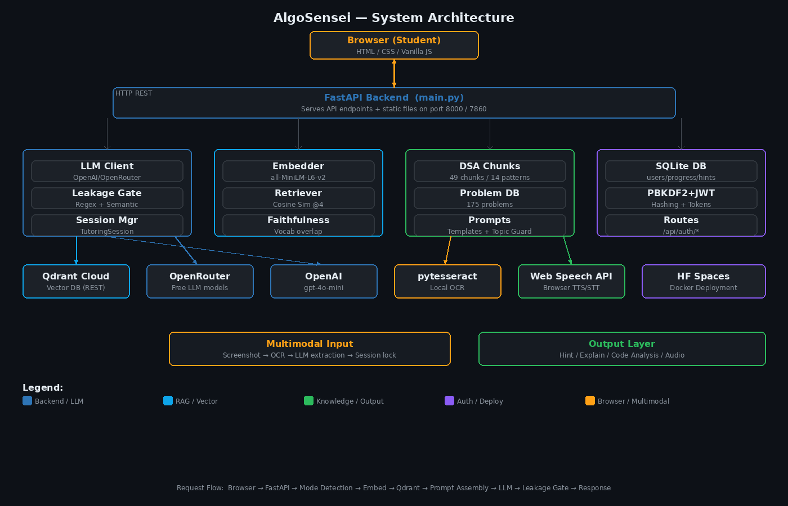

# 🧠 AlgoSensei

**The DSA tutor that guides you — without giving away the answer.**

AlgoSensei gives you calibrated Socratic hints for 175+ LeetCode problems. Instead of handing you the solution, it asks you the right questions until you arrive at the insight yourself. The leakage gate makes this architecturally enforced — the system cannot reveal the answer even if you ask directly.

🚀 **[Try it free](https://adityaamitra-algosensei.hf.space)** · 🌐 **[Website](https://adityaamitra.github.io/AlgoSensei-GenAI/)** · 🌐 **[Demo Video](https://youtu.be/DngHH4ujmcY)**

---

## Why AlgoSensei
 
Every DSA prep tool either solves the problem for you or gives vague encouragement. ChatGPT hands you the answer. Editorials walk you through the solution. There's no middle ground — until now.
 
AlgoSensei lives in the gap between *"I'm stuck"* and *"I looked up the answer."* It gives you the minimum hint needed to make progress, and it's enforced at the system level — not just a prompt instruction.
 
---
 
## Features
 
**💡 Three-level hints**
Direction → Structure → Near-solution. Each level gets one step closer without ever naming the algorithm or writing code. Every hint builds on the previous one.
 
**💻 Code analysis**
Paste your current attempt. AlgoSensei identifies exactly where your approach breaks down and asks one targeted question about it — not a generic observation, a question about your specific code.
 
**📸 Screenshot to session**
Upload any LeetCode problem screenshot. OCR reads the problem, detects the pattern, and starts a full tutoring session automatically.
 
**📖 Concept explainer**
Type any DSA concept. Get a grounded explanation with real-world analogies, complexity analysis, and a comprehension check — backed by a curated knowledge base.
 
**🔊 Audio output**
Every hint has a Listen button. Web Speech API reads it aloud so your eyes can stay on your code editor.
 
**👤 Progress tracking**
Create a free account. Track which problems you've solved, see your progress across 14 DSA patterns, and pick up where you left off.
 
**🛡️ Leakage gate**
Two-stage safety check on every response — regex for direct algorithm names, semantic check for subtle reveals. Verified 0% leakage rate across all hint levels.
 
---
 
## Getting Started
 
### Use the hosted version
 
**[https://adityaamitra-algosensei.hf.space](https://adityaamitra-algosensei.hf.space)**
 
No installation, no signup required. Create a free account to save progress.
 
### Run locally
 
**Prerequisites:** Python 3.11+, [Tesseract OCR](https://tesseract-ocr.github.io/tessdoc/Installation.html), free accounts at [OpenRouter](https://openrouter.ai/keys) and [Qdrant Cloud](https://cloud.qdrant.io)
 
```bash
git clone https://github.com/adityaamitra/AlgoSensei-GenAI
cd AlgoSensei-GenAI/algosensei_genai
 
pip install -r requirements.txt
 
# macOS
brew install tesseract
 
cp .env.example .env
# Edit .env with your API keys
 
# One-time setup: builds the knowledge base in Qdrant (~2 min)
python scripts/setup_qdrant.py
 
uvicorn main:app --reload --port 8000
```
 
Open `http://localhost:8000`
 
---
 
## Configuration
 
```bash
# .env
 
# Required
OPENROUTER_API_KEY=sk-or-v1-...     # openrouter.ai/keys
QDRANT_URL=https://...              # cloud.qdrant.io
QDRANT_API_KEY=...
JWT_SECRET=any-long-random-string
 
# Optional: use OpenAI instead of OpenRouter
LLM_PROVIDER=openai
OPENAI_API_KEY=sk-...
OPENAI_MODEL=gpt-4o-mini
 
# Optional: override the default model
OPENROUTER_MODEL=nvidia/llama-3.1-nemotron-ultra-253b-v1:free
```
 
**Total cost to run: $0** — OpenRouter free tier, Qdrant free tier (1GB), local embeddings, local OCR.
 
---
 
## Problem Coverage
 
**175 problems** across **14 DSA patterns** — full Blind 75, NeetCode 150, and Grind 169 coverage with difficulty ratings and company tags.
 
| Pattern | Problems |
|---|---|
| Arrays & Hashing | 21 |
| Trees | 17 |
| Graphs | 17 |
| Dynamic Programming 1D | 16 |
| Linked List | 14 |
| Dynamic Programming 2D | 13 |
| Backtracking | 11 |
| Sliding Window | 9 |
| Heap / Priority Queue | 9 |
| Greedy | 9 |
| Stack | 10 |
| Binary Search | 8 |
| Two Pointers | 7 |
| Tries | 5 |
 
Company tags included: Google, Amazon, Meta, Microsoft, Apple, Bloomberg, LinkedIn, Uber.
 
---
 
## How it works
 
```
Your question / screenshot
        ↓
Mode detection (hint / explain / code analysis / screenshot)
        ↓
Query embedded locally (all-MiniLM-L6-v2, zero API cost)
        ↓
Qdrant Cloud returns top-4 relevant knowledge chunks
        ↓
LLM generates Socratic hint grounded in retrieved context
        ↓
Leakage gate: regex + semantic check
Failed? → regenerate (up to 3×)
        ↓
Approved hint + 🔊 Listen button
```
 
---
 
## System Architecture
 

 
```
Browser (Student)
        ↕  HTTP
FastAPI Backend (main.py)
    ├── Auth Module
    │   ├── SQLite DB          ← users, progress, hint_history
    │   ├── PBKDF2 + JWT       ← password hashing, token signing
    │   └── /api/auth/*        ← signup, login, progress endpoints
    │
    ├── AI Engine
    │   ├── LLM Client         ← OpenAI / OpenRouter (pure HTTP)
    │   ├── Leakage Gate       ← Stage 1: Regex · Stage 2: Semantic
    │   └── Tutoring Session   ← hint levels, context memory
    │
    ├── RAG Pipeline
    │   ├── Embedder           ← all-MiniLM-L6-v2 (local, zero API cost)
    │   ├── Qdrant REST        ← vector search, cosine similarity @4
    │   └── Retriever          ← faithfulness scoring, citation labels
    │
    ├── Knowledge Base
    │   ├── 49 DSA chunks      ← 14 patterns, sourced from CLRS/MIT/Stanford
    │   └── 175 problems       ← Blind 75 + NeetCode 150 + Grind 169
    │
    └── Multimodal
        ├── pytesseract OCR    ← local, no cloud vision API
        └── Web Speech API     ← browser-native audio output
```
 
### Request Flow
 
```
Student input
    → Mode detection (hint / explain / code analysis / screenshot)
    → Query embedding (local, zero API cost)
    → Qdrant retrieval (top-4 chunks, cosine similarity)
    → Prompt assembly (chunks + context + hint level + previous hints)
    → LLM generation (OpenAI gpt-4o-mini or OpenRouter free models)
    → Leakage gate (regex + semantic — failed? regenerate up to 3×)
    → Approved hint delivered
```
 
---
 
## API Endpoints
 
| Method | Endpoint | Description |
|---|---|---|
| `POST` | `/api/hint` | Generate Socratic hint |
| `POST` | `/api/explain` | Explain a DSA concept |
| `POST` | `/api/analyze-code` | Analyze code attempt |
| `POST` | `/api/screenshot` | Process screenshot |
| `GET` | `/api/problems` | List problems (filterable) |
| `POST` | `/api/auth/signup` | Create account |
| `POST` | `/api/auth/login` | Sign in |
| `GET` | `/api/auth/progress` | Get user progress |
| `POST` | `/api/auth/progress` | Save progress |
 
---
 
## Tech Stack
 
| Component | Technology |
|---|---|
| Backend | FastAPI + uvicorn |
| Frontend | Vanilla HTML / CSS / JS |
| LLM | OpenRouter (free) or OpenAI |
| Vector DB | Qdrant Cloud |
| Embeddings | all-MiniLM-L6-v2 (local) |
| OCR | pytesseract (local) |
| Auth | SQLite + JWT (no external service) |
| Hosting | Hugging Face Spaces (Docker) |
 
---
 
## Contributing
 
Issues and pull requests are welcome. If you find a hint that reveals the answer directly, please open an issue — that's a leakage gate miss and should be fixed.
 
---
 
## License
 
```
MIT License
 
Copyright (c) 2026 Aditya Mitra
 
Permission is hereby granted, free of charge, to any person obtaining a copy
of this software and associated documentation files (the "Software"), to deal
in the Software without restriction, including without limitation the rights
to use, copy, modify, merge, publish, distribute, sublicense, and/or sell
copies of the Software, and to permit persons to whom the Software is
furnished to do so, subject to the following conditions:
 
The above copyright notice and this permission notice shall be included in all
copies or substantial portions of the Software.
 
THE SOFTWARE IS PROVIDED "AS IS", WITHOUT WARRANTY OF ANY KIND, EXPRESS OR
IMPLIED, INCLUDING BUT NOT LIMITED TO THE WARRANTIES OF MERCHANTABILITY,
FITNESS FOR A PARTICULAR PURPOSE AND NONINFRINGEMENT. IN NO EVENT SHALL THE
AUTHORS OR COPYRIGHT HOLDERS BE LIABLE FOR ANY CLAIM, DAMAGES OR OTHER
LIABILITY, WHETHER IN AN ACTION OF CONTRACT, TORT OR OTHERWISE, ARISING FROM,
OUT OF OR IN CONNECTION WITH THE SOFTWARE OR THE USE OR OTHER DEALINGS IN THE
SOFTWARE.
```
 
---
 
Built by [Aditya Mitra](https://github.com/adityaamitra)